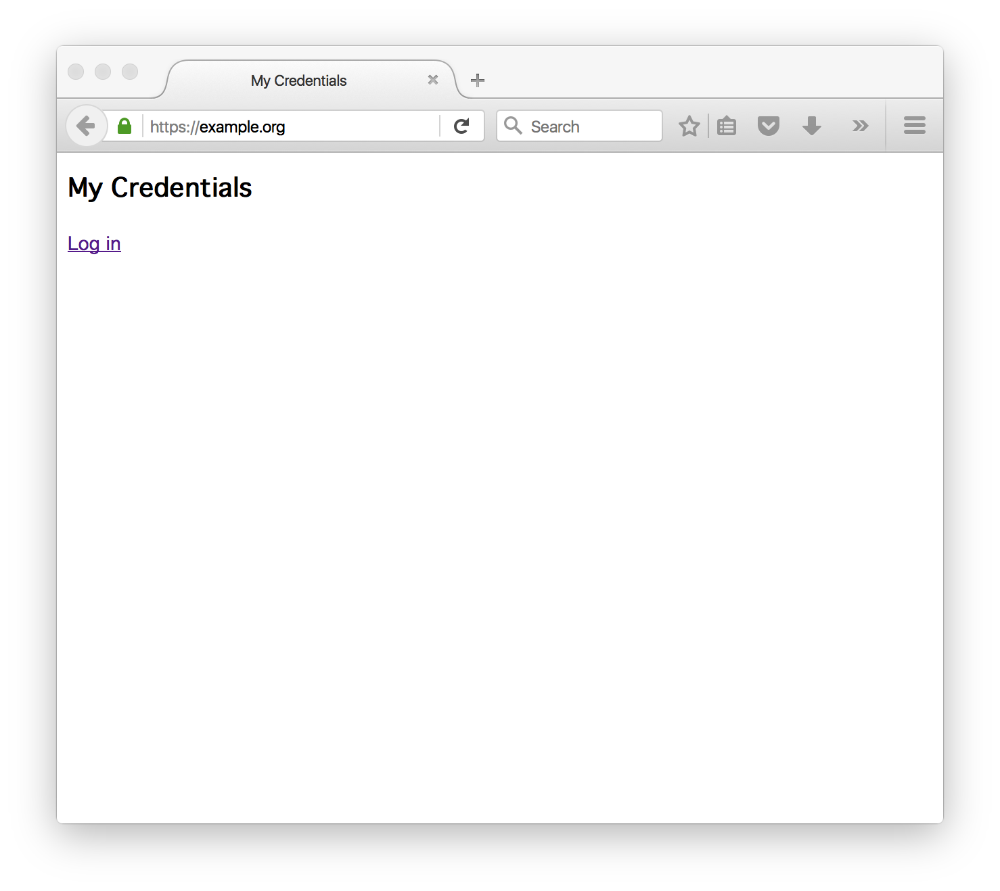
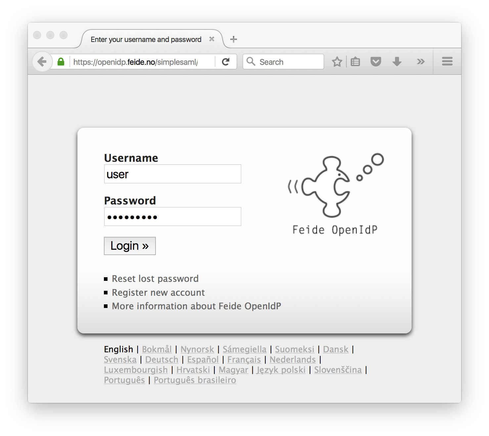
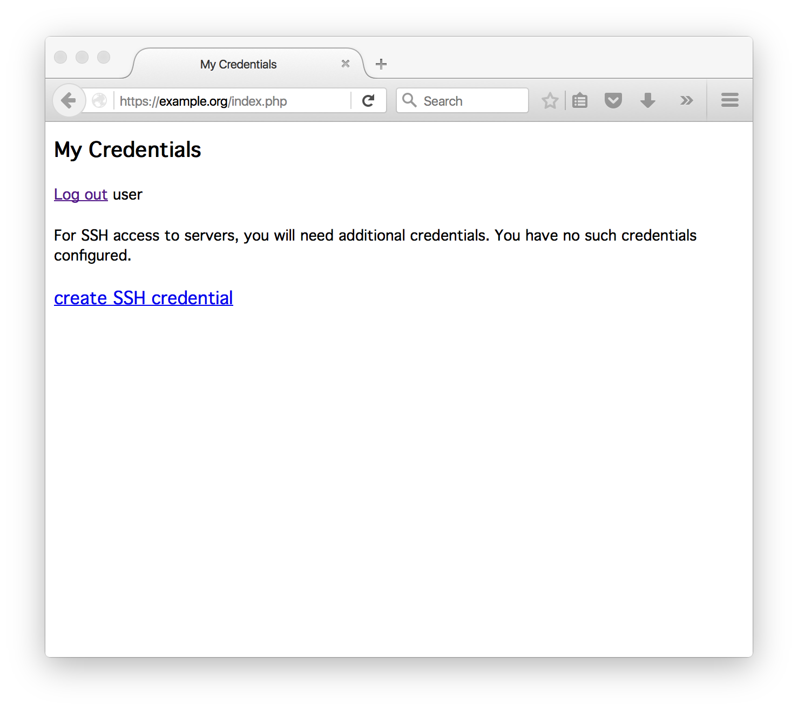
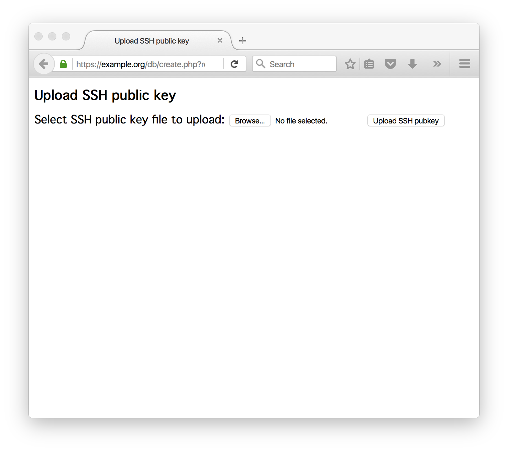
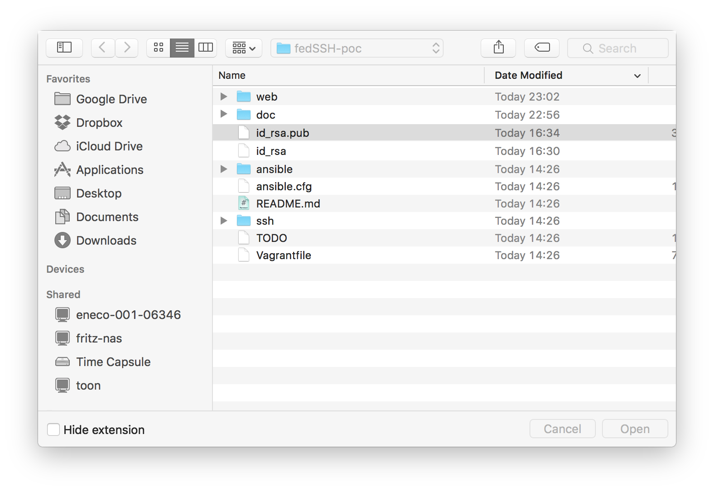
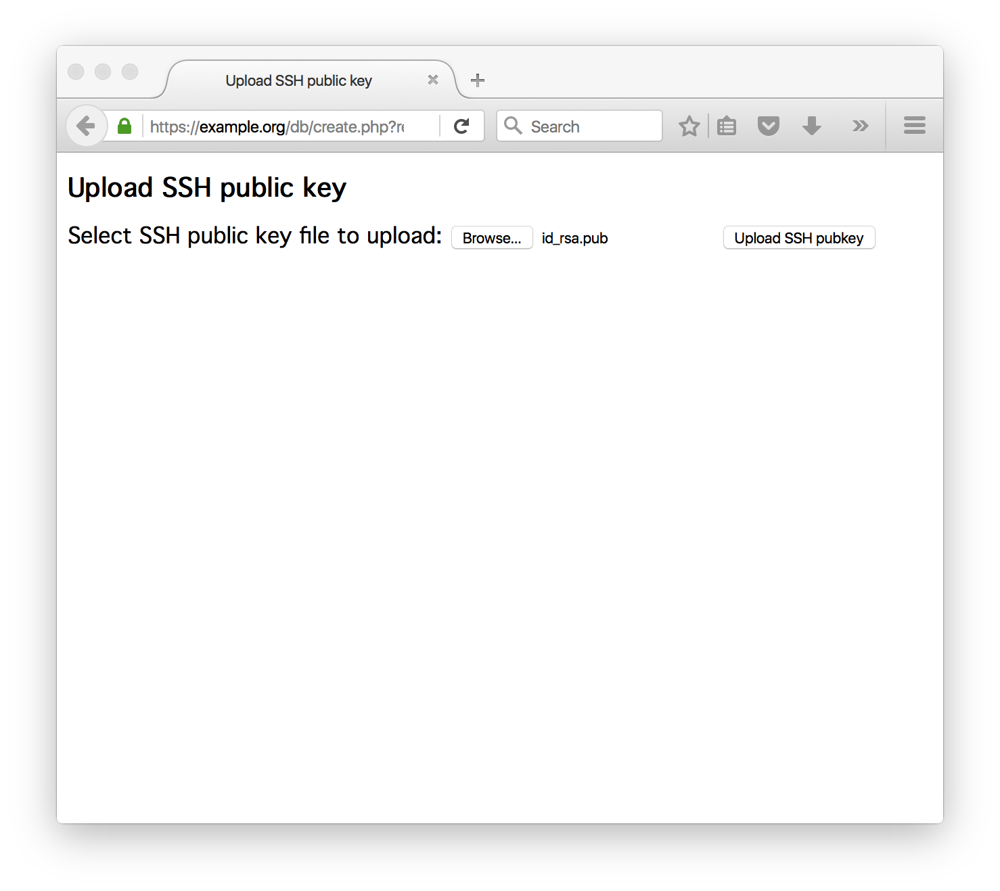
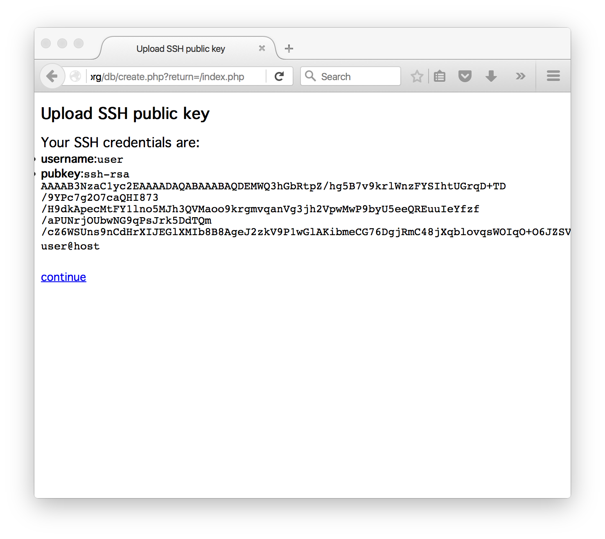
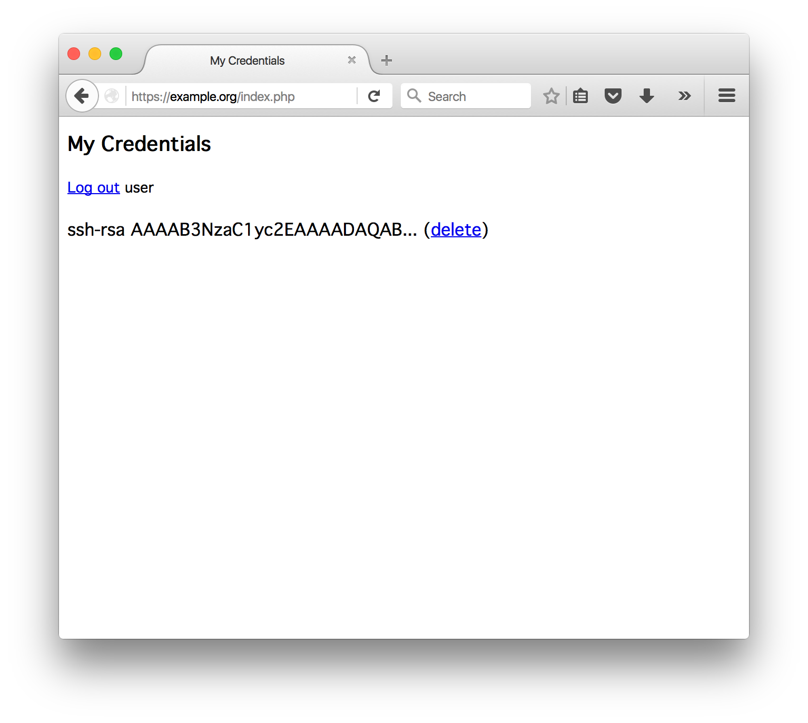

# Tutorial

This tutorial walks you through the procedure for setting up the proof of concept on VirtualBox VMs. Your host system could run any OS that supports VirtualBox. In this tutorial, OSX is used as an example.

## Install software

The proof of concept uses two Virtual Machines: one running an SSH server, and one running a web application for registering application credentials (SSH pubkeys).
The VMs can run locally, or at a cloud provider. In this tutorial we will assume you are running VMs on a local machine using [VirtualBox](https://www.virtualbox.org).

- [Download](https://www.virtualbox.org/wiki/Downloads) and install Virtual Box.

To be able to create and manage VMs from the command line, we use [Vagrant](https://www.vagrantup.com).

- [Download](https://www.vagrantup.com/downloads.html) and install Vagrant.

To provision the virtual machines, we use [Ansible](http://www.ansible.com).

- [Download](http://docs.ansible.com/ansible/intro_installation.html) and install Ansible.

To obtain the code from Github, [Git](https://git-scm.com) is used.

- [Download](https://git-scm.com/downloads) and install Git.

## Launch VMs

Check out the proof-of-concept code from github using git:

	[user@host:~]$ git clone https://github.com/joostd/fedSSH-poc.git
	Cloning into 'fedSSH-poc'...
	remote: Counting objects: 115, done.
	remote: Total 115 (delta 0), reused 0 (delta 0), pack-reused 114
	Receiving objects: 100% (115/115), 17.15 KiB | 0 bytes/s, done.
	Resolving deltas: 100% (32/32), done.
	Checking connectivity... done.
	
Create and provision the VMs using Vagrant and Ansible:

	[user@host:~]$ cd fedSSH-poc/
	[user@host:~]$ vagrant up
	Bringing machine 'web' up with 'virtualbox' provider...
	Bringing machine 'ssh' up with 'virtualbox' provider...
	==> web: Importing base box 'ubuntu/trusty64'...
	...
	==> web: Running provisioner: ansible...
	...

## Fix your hostnames

The Vagrant file has set up your VMs with fixed IP addresses: `192.168.100.10` for the web server, and `192.168.100.11` for the SSH server.
We like to refer to them using the domain names `example.org` and `ssh.example.org`, respectively.
It is convenient to add these name to your `hosts` file:

	[user@host:~]$ sudo sh -c "echo '192.168.100.10 example.org' >> /etc/hosts"
	[user@host:~]$ sudo sh -c "echo '192.168.100.11 ssh.example.org' >> /etc/hosts"

## Run the demo

The SSH server will have a user named `ubuntu`, but this user cannot authenticate without an SSH key:

	[user@host:~]$ ssh ubuntu@ssh.example.org
	Permission denied (publickey).

To authenticate to the SSH server, the user needs to register SSH keys. So first generate SSH keys:

	[user@host:~]$ ssh-keygen -f ./id_rsa
	Generating public/private rsa key pair.
	Enter passphrase (empty for no passphrase): 
	Enter same passphrase again: 
	Your identification has been saved in ./id_rsa.
	Your public key has been saved in ./id_rsa.pub.
	The key fingerprint is:
	SHA256:NDcy4wTSnM/Sjs6lgfLHsUwmyTPltPHgK+zSgt5NIIY user@host
	The key's randomart image is:
	+---[RSA 2048]----+
	|    .o..         |
	|     .+.         |
	|       +B o      |
	|.     *++* .     |
	|Eo o B OS        |
	|. o O X +        |
	| . = % B         |
	|. + B X          |
	|.. =.+           |
	+----[SHA256]-----+

The keys are stored locally in files `id_rsa` and `id_rsa.pub`, containing the private key and public key, respectively. The public key that needs to be registered looks like:

	[user@host:~]$ cat id_rsa.pub 
	ssh-rsa AAAAB3NzaC1yc2EAAAADAQABAAABAQDEMWQ3hGbRtpZ/hg5B7v9krlWnzFYSIhtUGrqD+TD/9YPc7g2O7caQHI873/H9dkApecMtFY1lno5MJh3QVMaoo9krgmvqanVg3jh2VpwMwP9byU5eeQREuuIeYfzf/aPUNrjOUbwNG9qPsJrk5DdTQm/cZ6WSUns9nCdHrXIJEGlXMIb8B8AgeJ2zkV9P1wGlAKibmeCG76DgjRmC48jXqblovqsWOIqO+O6JZSVzvaO+DH1OcwMGcVmZwGw1N4wJpLmHtuzcYIuLHk0SXIt9kIjwjRmMfrYki+Y72kbjxiH8ZXGfWovLXQH3FSflDinM2OOO2LY9eprcMKsCbOgX user@host

The private key should be securely stored locally.

# Register your SSH keys

To use the fresh SSH keys to authenticate to the SSH server, you will now need to launch your web browser and point it to the web application at the URL
[https://example.org/](https://example.org/).

Note: Safari users will have trouble viewing this page, as `example.com` is a reserved domain name for documentation. In that case: use a different browser.

This web application uses [Feide OpenIDP](https://openidp.feide.no/) as its Identity Provider. This is an IdP that is very convenient for testing, as anyone can generate an account and use it for registered Service Providers. The metadata for our web application is already registered at OpenIDP. Of course, in a real setup this Service Provider would need to hookup to your IdP, either directly or using an Identity Federation.

[Sign up](https://openidp.feide.no/simplesaml/module.php/selfregister/newUser.php) for an account if you haven't done so already.

Note: The OpenIdP has shut down on January 1 2016. It is however still possible to authenticate to the PoC web application.

Click "Log in" to authenticate at OpenIDP:

When logging in for the first time, you will have no credentials registered:

Click "create SSH credential" to register your keys:

Select your public key. Do not upload the private key!

When selected, click "Upload SSH pubkey"

The server will verify that you submitted an SSH pubkey:

Your credentials are now registered:

# Use your SSH keys to logon to the  SSH server

Next, use your fresh SSH keys to authenticate to the SSH server:

	[user@host:~]$ ssh ubuntu@ssh.example.org -i ./id_rsa
	Welcome to Ubuntu 14.04.3 LTS (GNU/Linux 3.13.0-76-generic x86_64)

	 * Documentation:  https://help.ubuntu.com/

	  System information as of Mon Jan 25 15:27:49 UTC 2016

	  System load:  0.0               Processes:           73
	  Usage of /:   3.5% of 39.34GB   Users logged in:     0
	  Memory usage: 27%               IP address for eth0: 10.0.2.15
	  Swap usage:   0%                IP address for eth1: 192.168.100.11

	  Graph this data and manage this system at:
	    https://landscape.canonical.com/

	  Get cloud support with Ubuntu Advantage Cloud Guest:
	    http://www.ubuntu.com/business/services/cloud

	Last login: Mon Jan 25 15:27:49 2016 from 192.168.100.1
	ubuntu@ssh:~$ 

# Finished

That is all. To clean up and destroy your VMs:

	[user@host:~]$ vagrant destroy web ssh
